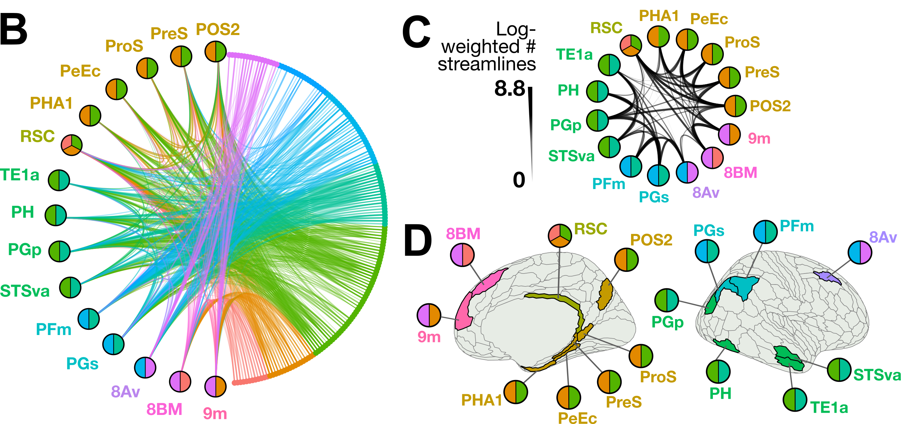

# Benchmarking overlapping community detection methods for applications in human connectomics

This repository contains all code needed to reproduce analyses and visuals presented in our preprint, [Benchmarking overlapping community detection methods for applications in human connectomics](https://www.biorxiv.org/content/10.1101/2025.03.19.643839).



# Data availability

All diffusion magnetic resonance imaging (MRI) data used in this study is freely accessible as part of the [S1200 Subjects Data Release](https://www.humanconnectome.org/study/hcp-young-adult/document/1200-subjects-data-release) from the [Human Connectome Project[(https://www.humanconnectome.org/study/hcp-young-adult/data-releases)].

❗ All **intermediate data files** needed to replicate analysis and visuals in this project, including the preprocessed consensus group structural connectome in the right cortex ([RH.mat](https://github.com/DynamicsAndNeuralSystems/OverlappingCommunityDetection_HCP/tree/main/data/HCP_Connectome/RH.mat)), are included in the `data/` folder.

# Usage

## Installation

First, clone this repository to your local machine:

    ```bash
    git clone https://github.com/DynamicsAndNeuralSystems/OverlappingCommunityDetection_HCP.git
    ```

This project employs a mixture of: 
* Matlab (R2024a) for diffusion MRI connectome preprocessing, benchmark network ensemble simulation, and graph theory statistic computation (e.g., Louvain clustering, extended normalized mutual information computation) 
* python (v 3.9.17) for data visualization (network diagrams and connectogram plots) and comparison to functional brain maps of resting-state netowrks and principal gradient of functional connectivity
* R (v 4.4.2) for all other data visualization

We recommend that users create a conda environment for this project, which can be accomplished as follows:

    ```bash
    conda create -n OverlappingCommunityDetection_HCP python=3.9.0
    conda activate OverlappingCommunityDetection_HCP
    ```

From this conda environment, install the required Python packages:

    ```bash
    pip install -r requirements.txt
    ```

R packages required for data visualization can be installed from the `install_R_packages_for_visualization.R` script as follows:

    ```bash
    Rscript install_R_packages_for_visualization.R
    ```

For the comparison to functional brain maps (in Figure 5), full functionality requires a working installation of [Connectome Workbench](https://www.humanconnectome.org/software/connectome-workbench).
The following line is included in [Fig5_functional_interpretation.ipynb](https://github.com/DynamicsAndNeuralSystems/OverlappingCommunityDetection_HCP/tree/main/data_visualization/Fig5_functional_interpretation.ipynb), and the path to workbench should be modified (this example is for 64-bit Mac OSX):

```python
import os
os.environ['PATH'] = os.environ['PATH'] + ':/Applications/workbench/bin_macosx64'
```

## Route 1: Using supplied pre-computed data to reproduce visuals

All required data is provided to plug-and-play with the Jupyter notebooks in [`data_visualization/`](https://github.com/DynamicsAndNeuralSystems/OverlappingCommunityDetection_HCP/tree/main/data_visualization).

#### Figure 2: Human right cortical connectome properties

Elements of this figure can be recreated by running the Jupyter notebook [Fig2_connectome_network_properties.ipynb](https://github.com/DynamicsAndNeuralSystems/OverlappingCommunityDetection_HCP/tree/main/data_visualization/Fig2_connectome_network_properties.ipynb).

#### Figure 3: Comparing OCDA performances across benchmark ensemble, with a focus on network 56 as an example

Elements of this figure can be recreated by running the Matlab script [Fig3_networks.m](https://github.com/DynamicsAndNeuralSystems/OverlappingCommunityDetection_HCP/tree/main/data_visualization/Fig3_networks.m) and the Jupyter notebook [Fig3_ENMI_by_algorithm.ipynb](https://github.com/DynamicsAndNeuralSystems/OverlappingCommunityDetection_HCP/tree/main/data_visualization/Fig3_ENMI_by_algorithm.ipynb).

#### Figure 4: Overlapping brain networks derived from the OSLOM-30 decomposition

Elements of this figure can be recreated by running the Jupyter notebook [Fig4_brain_networks.ipynb](https://github.com/DynamicsAndNeuralSystems/OverlappingCommunityDetection_HCP/tree/main/data_visualization/Fig4_brain_networks.ipynb).

#### Figure 5: Examining functional brain-map properties of overlapping regions

Elements of this figure can be recreated by running the Jupyter notebook [Fig5_functional_interpretation.ipynb](https://github.com/DynamicsAndNeuralSystems/OverlappingCommunityDetection_HCP/tree/main/data_visualization/Fig5_functional_interpretation.ipynb).

#### Figure 6: Comparing OSLOM with Louvain, a traditional non-overlapping community detection algorithm

Elements of this figure can be recreated by running the Jupyter notebook [Fig6_OSLOM_vs_Louvain.ipynb](https://github.com/DynamicsAndNeuralSystems/OverlappingCommunityDetection_HCP/tree/main/data_visualization/Fig6_OSLOM_vs_Louvain.ipynb).

## Route 2: Re-computing benchmark network ensembles and applying OCDAs to both simulated + empirical data

### Part 1: Simulating benchmark networks

All code needed to generate and evaluate the synthetic benchmark network ensemble can be found in the [`generate_benchmark_networks/`](https://github.com/DynamicsAndNeuralSystems/OverlappingCommunityDetection_HCP/tree/main/generate_benchmark_networks) folder.

The main driver script to run is `compute_ENMI_for_benchmark_vs_synthetic.m`, which includes three key steps: 
1. Simulate 1000 benchmark networks using the algorithm from [Lancichinetti & Fortunato (2009)](https://journals.aps.org/pre/abstract/10.1103/PhysRevE.80.016118). This script calls `generate_synthetic_networks.m`, which defines key parameters for the network generation algorithm; these parameters, and the motivation behind their selection, are described in the [preprint](https://www.biorxiv.org/content/10.1101/2025.03.19.643839) (sections 'Generating benchmark networks' and 'The connectome-tailored benchmark network ensemble highlights OSLOM as the top-performing algorithm'). 
We recommend running `compute_ENMI_for_benchmark_vs_synthetic.m` directly in the MATLAB GUI. 
2. Apply the five OCDA methods and their parameter combinations for a total of 22 OCDA methods to the benchmark network ensemble. This script calls [generate_benchmark_networks/Computation/OCLD_Compute.m](https://github.com/DynamicsAndNeuralSystems/OverlappingCommunityDetection_HCP/tree/main/generate_benchmark_networks/Computation/OCLD_Compute.m) to apply the methods across simulated networks. The methods and their parameters are described in the [preprint](https://www.biorxiv.org/content/10.1101/2025.03.19.643839) (section 'Overlapping Community Detection Algorithms').
3. Compute the ENMI between the ground-truth overlapping community assignment and that predicted by each of the 22 OCDAs for each simulated benchmark network. This script calls [`OCDA_evaluation/ENMI_calc.m`](https://github.com/DynamicsAndNeuralSystems/OverlappingCommunityDetection_HCP/tree/main/OCDA_evaluation/ENMI_calc.m) to compare each overlapping community decomposition.

### ‼️ Troubleshooting

If you run into issues with OSLOM or Infomap saying the binary file cannot be executed, we recommend you try to re-compile the corresponding algorithm C++ programs.
For **OSLOM**: 
Download the package from the source website ([http://www.oslom.org/software.htm](http://www.oslom.org/software.htm))

```bash
cd generate_benchmark_networks/Computation/SourceCode

# Remove the current OSLOM folder
rm -r OSLOM

# Download and unzip OSLOM from source
curl http://www.oslom.org/code/OSLOM2.tar.gz
tar -xzvf OSLOM2

% Rename to 'OSLOM' to be compatible with other repository code
mv OSLOM2 OSLOM
cd OSLOM
./compile_all.sh
```

For **Infomap**, the more recent online versions have removed the `-overlap` flag such that we need to use the version included in this repository.
You can simply remove the built versions of Infomap and re-compile yourself as follows:
```bash
# Need to remove the current builds
rm Infomap
rm -r build/

# Use make to compile
make
```

### Part 2: Applying OSLOM-30 to the right cortical structural connectome

